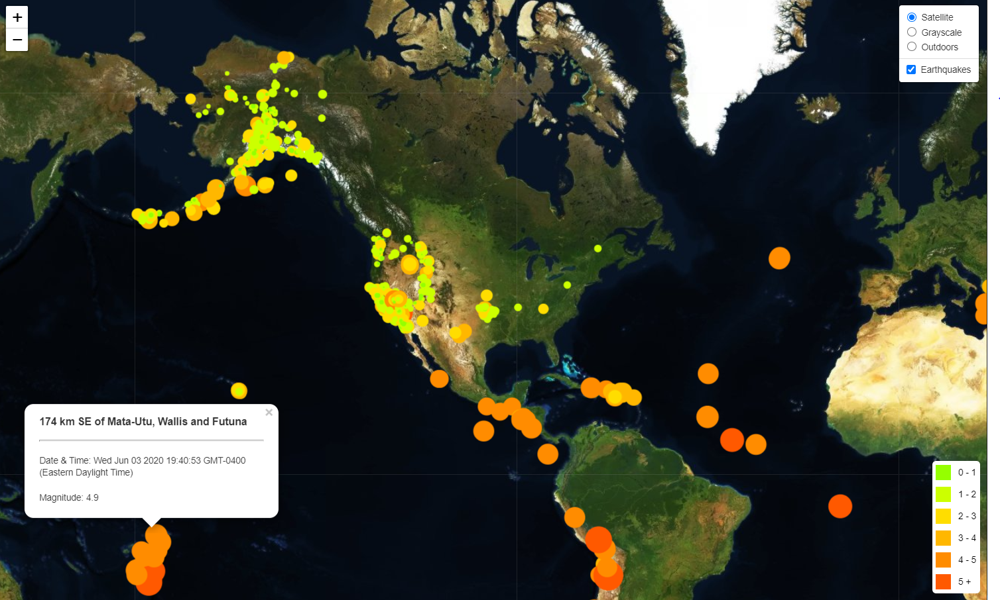

## Visualizing Data with Leaflet

The United States Geological Survey (USGS) provides scientific data about natural hazards, the health of our ecosystems and environment; and the impacts of climate and land-use change. Their scientists develop new methods and tools to supply timely, relevant, and useful information about the Earth and its processes. This repository contains visualization of their earthquake data for the past 1 week.

